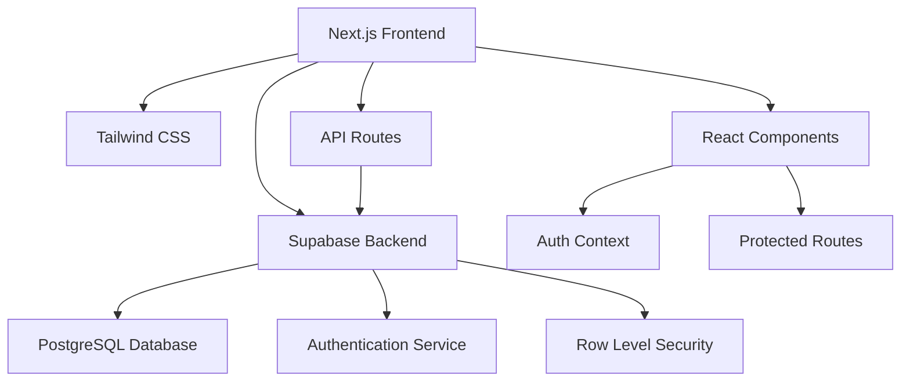
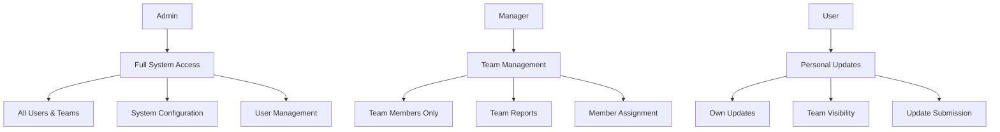

# 🏢 Aditi Daily Updates System

[](https://github.com/aditi-consulting/daily-updates)
[](https://nextjs.org/)
[](https://www.typescriptlang.org/)
[](https://supabase.com/)
[](https://tailwindcss.com/)

> **Enterprise-grade daily task tracking and team management platform for Aditi Consulting**

A modern, secure, and feature-rich web application designed to streamline daily employee updates, task tracking, and team collaboration across the organization.


## 📋 Table of Contents

- [🎯 Overview](#-overview)
- [✨ Features](#-features)
- [🏗️ Architecture](#️-architecture)
- [🔧 Technology Stack](#-technology-stack)
- [🚀 Quick Start](#-quick-start)
- [📱 Usage Guide](#-usage-guide)
- [🔐 Authentication System](#-authentication-system)
- [👥 User Roles & Permissions](#-user-roles--permissions)
- [🗄️ Database Schema](#️-database-schema)
- [🎨 UI Components](#-ui-components)
- [🔄 Recent Updates](#-recent-updates)
- [🌐 Deployment](#-deployment)
- [🛠️ Troubleshooting](#️-troubleshooting)
- [📈 Performance](#-performance)
- [🤝 Contributing](#-contributing)

## 🎯 Overview

The Aditi Daily Updates System is a comprehensive enterprise solution designed to facilitate seamless daily progress tracking, team management, and project collaboration. Built with modern web technologies, it provides a robust platform for organizations to monitor employee productivity, track task completion, and manage team dynamics effectively.

### Key Business Benefits

- **Enhanced Productivity**: Streamlined daily update process reduces administrative overhead
- **Real-time Visibility**: Managers get instant insights into team progress and blockers
- **Data-Driven Decisions**: Comprehensive analytics and export capabilities
- **Scalable Architecture**: Supports growing teams and increasing data volumes
- **Security First**: Enterprise-grade authentication and data protection

## ✨ Features

### 🔐 Authentication & Security
- **Multi-Method Authentication**: Password-based and Magic Link (OTP) authentication
- **Role-Based Access Control (RBAC)**: Three-tier permission system
- **Session Management**: Robust tab-switching and session persistence
- **Password Reset**: Secure email-based password recovery
- **Data Protection**: Row-level security with Supabase

### 📊 Dashboard & Analytics
- **Real-time Dashboards**: Role-specific views with live data updates
- **Advanced Filtering**: Filter by date ranges, teams, status, and priority
- **Export Functionality**: CSV/Excel export for reporting and analysis
- **Visual Analytics**: Progress charts and team performance metrics
- **Search Capabilities**: Full-text search across all updates

### 📝 Task Management
- **Daily Update Forms**: Comprehensive task tracking with multiple fields
- **Status Tracking**: In Progress, Completed, Blocked, To-Do status management
- **Priority Management**: High, Medium, Low priority classification
- **Story Points**: Agile-friendly effort estimation
- **Blocker Management**: Track risks, dependencies, and impediments

### 👥 Team Collaboration
- **Team Management**: Create, edit, and manage team structures
- **Team Member Assignment**: Flexible team membership management
- **Manager Assignment**: Hierarchical reporting relationships
- **Cross-team Visibility**: Controlled access to team information

### 📱 User Experience
- **Responsive Design**: Optimized for desktop, tablet, and mobile devices
- **Dark Theme**: Professional dark UI with purple accent colors
- **Real-time Notifications**: Toast notifications for user feedback
- **Progressive Web App**: Fast loading and offline capabilities
- **Accessibility**: WCAG compliant with keyboard navigation support

## 🏗️ Architecture

### System Architecture



### Frontend Architecture

```
src/
├── components/              # Reusable UI Components
│   ├── AuthSelector.tsx     # Authentication method selection
│   ├── AuthPassword.tsx     # Password authentication
│   ├── AuthOTP.tsx         # Magic link authentication
│   ├── DailyUpdateForm.tsx # Main update form
│   ├── EditUpdateModal.tsx # Update editing modal
│   ├── ProtectedRoute.tsx  # Route protection wrapper
│   └── LoadingSpinner.tsx  # Loading states
├── lib/                    # Core Logic & Utilities
│   ├── authContext.tsx     # Authentication state management
│   └── supabaseClient.ts   # Database client configuration
├── pages/                  # Next.js Pages & Routes
│   ├── index.tsx          # Landing/Login page
│   ├── dashboard.tsx      # Admin/Manager dashboard
│   ├── user-dashboard.tsx # User dashboard
│   ├── daily-update-form.tsx # Update submission
│   ├── team-management.tsx   # Team administration
│   ├── reset-password.tsx    # Password recovery
│   └── api/               # API endpoints
└── styles/                 # Global Styles
    └── globals.css        # Tailwind and custom styles
```

## 🔧 Technology Stack

### Frontend Technologies
| Technology | Version | Purpose |
|------------|---------|---------|
| **Next.js** | 14.1.3 | React framework with SSR/SSG |
| **React** | ^18 | User interface library |
| **TypeScript** | ^5 | Type-safe JavaScript |
| **Tailwind CSS** | ^3.3.0 | Utility-first CSS framework |
| **React Hot Toast** | ^2.5.2 | Notification system |

### Backend Technologies
| Technology | Version | Purpose |
|------------|---------|---------|
| **Supabase** | ^2.49.1 | Backend-as-a-Service |
| **PostgreSQL** | Latest | Primary database |
| **Row Level Security** | Built-in | Data access control |
| **Supabase Auth** | Built-in | Authentication service |

### Development Tools
| Tool | Purpose |
|------|---------|
| **ESLint** | Code linting and formatting |
| **Prettier** | Code formatting |
| **PostCSS** | CSS processing |
| **Autoprefixer** | CSS vendor prefixing |

## 🚀 Quick Start

### Prerequisites

Before you begin, ensure you have the following installed:

- **Node.js** (v18 or higher)
- **npm** or **yarn** package manager
- **Git** for version control
- **Supabase Account** for backend services

### Installation Steps

1. **Clone the Repository**
   ```bash
   git clone https://github.com/aditi-consulting/daily-updates-v6.git
   cd daily-updates-v6
   ```

2. **Install Dependencies**
   ```bash
   npm install
   # or
   yarn install
   ```

3. **Environment Setup**
   ```bash
   cp .env.example .env.local
   ```

4. **Configure Environment Variables**
   ```env
   NEXT_PUBLIC_SUPABASE_URL=your_supabase_project_url
   NEXT_PUBLIC_SUPABASE_ANON_KEY=your_supabase_anon_key
   NEXT_PUBLIC_SITE_URL=http://localhost:3000
   ```

5. **Database Setup**
   ```bash
   # Run the SQL schema in your Supabase dashboard
   # Files located in ./sql/ directory
   ```

6. **Start Development Server**
   ```bash
   npm run dev
   ```

7. **Access the Application**
   - Open [http://localhost:3000](http://localhost:3000) in your browser
   - Follow the setup wizard to create your first admin account

### Initial Setup Wizard

The application includes a built-in setup wizard accessible at `/setup` that guides you through:

1. **Database Schema Installation**
2. **Admin Account Creation**
3. **Initial Team Setup**
4. **Configuration Verification**

## 📱 Usage Guide

### For End Users

#### 1. **Login Process**
- Navigate to the application URL
- Choose authentication method (Password or Magic Link)
- Complete the login process
- Automatic redirection based on user role

#### 2. **Daily Update Submission**
- Access the Daily Update Form from the user dashboard
- Fill in required fields:
  - **Employee Information**: Name, ID, Email, Team
  - **Tasks**: List of completed/ongoing tasks
  - **Date Range**: Start and end dates
  - **Status**: Current task status
  - **Priority**: Task priority level
  - **Story Points**: Effort estimation (optional)
  - **Additional Notes**: Comments and blockers

#### 3. **Dashboard Navigation**
- **User Dashboard**: View personal updates and submit new ones
- **Filtering**: Use date ranges and status filters
- **Search**: Find specific updates quickly
- **Export**: Download updates as CSV/Excel

### For Managers

#### 1. **Team Overview**
- Access comprehensive team dashboards
- View all team member updates
- Monitor progress and identify blockers
- Export team reports

#### 2. **Team Management**
- Add/remove team members
- Assign reporting relationships
- Manage team settings

### For Administrators

#### 1. **System Administration**
- Access all organizational data
- Manage users and permissions
- Configure system settings
- Monitor system health

#### 2. **Analytics & Reporting**
- Generate organization-wide reports
- Export comprehensive datasets
- Monitor usage patterns
- Track system metrics

## 🔐 Authentication System

### Multi-Layer Authentication Strategy

The application implements a sophisticated authentication system with multiple security layers:

#### 1. **Authentication Methods**

**Password Authentication**
- Email/password combination
- Secure password hashing with Supabase Auth
- Password complexity requirements
- Account lockout protection

**Magic Link Authentication**
- Email-based one-time password (OTP)
- Secure token generation
- Time-limited access codes
- No password storage required

#### 2. **Session Management**

**Robust Session Persistence**
- Multi-tier backup system (sessionStorage + localStorage + session backup)
- Session lock mechanism preventing race conditions
- Intelligent session management with immediate restoration
- Enhanced tab visibility handling
- Retry logic for database queries

**Tab Switching Protection**
- Comprehensive authentication state preservation
- Automatic session recovery on tab switch
- Background session verification
- Zero UI blocking during verification

#### 3. **Security Features**

- **Row Level Security (RLS)**: Database-level access control
- **JWT Token Management**: Secure token handling and refresh
- **CSRF Protection**: Cross-site request forgery prevention
- **Session Timeout**: Configurable session expiration
- **Secure Headers**: HTTP security headers implementation

## 👥 User Roles & Permissions

### Role Hierarchy



### Detailed Permissions Matrix

| Feature | Admin | Manager | User |
|---------|-------|---------|------|
| **View All Updates** | ✅ | ❌ | ❌ |
| **View Team Updates** | ✅ | ✅ | ✅* |
| **Submit Updates** | ✅ | ✅ | ✅ |
| **Edit Own Updates** | ✅ | ✅ | ✅ |
| **Edit Others' Updates** | ✅ | ✅** | ❌ |
| **Delete Updates** | ✅ | ✅** | ❌ |
| **Manage Teams** | ✅ | ✅** | ❌ |
| **Manage Users** | ✅ | ❌ | ❌ |
| **System Setup** | ✅ | ❌ | ❌ |
| **Export All Data** | ✅ | ❌ | ❌ |
| **Export Team Data** | ✅ | ✅ | ❌ |
| **Export Own Data** | ✅ | ✅ | ✅ |

*Only for updates within their team  
**Only for their assigned team members

### Role Assignment Process

1. **Admin Creation**: First user becomes admin through setup wizard
2. **Manager Assignment**: Admins can promote users to managers
3. **Team Assignment**: Users are assigned to teams by admins/managers
4. **Permission Inheritance**: Roles inherit permissions from lower levels

## 🗄️ Database Schema

### Core Tables

#### `aditi_users`
```sql
CREATE TABLE aditi_users (
    id UUID PRIMARY KEY DEFAULT gen_random_uuid(),
    email VARCHAR(255) UNIQUE NOT NULL,
    name VARCHAR(255) NOT NULL,
    role VARCHAR(50) DEFAULT 'user',
    employee_id VARCHAR(100),
    team_id UUID REFERENCES aditi_teams(id),
    manager_id UUID REFERENCES aditi_users(id),
    created_at TIMESTAMP WITH TIME ZONE DEFAULT NOW(),
    updated_at TIMESTAMP WITH TIME ZONE DEFAULT NOW()
);
```

#### `aditi_teams`
```sql
CREATE TABLE aditi_teams (
    id UUID PRIMARY KEY DEFAULT gen_random_uuid(),
    team_name VARCHAR(255) NOT NULL,
    description TEXT,
    manager_id UUID REFERENCES aditi_users(id),
    created_at TIMESTAMP WITH TIME ZONE DEFAULT NOW(),
    updated_at TIMESTAMP WITH TIME ZONE DEFAULT NOW()
);
```

#### `aditi_daily_updates`
```sql
CREATE TABLE aditi_daily_updates (
    id UUID PRIMARY KEY DEFAULT gen_random_uuid(),
    employee_name VARCHAR(255) NOT NULL,
    employee_id VARCHAR(100) NOT NULL,
    employee_email VARCHAR(255) NOT NULL,
    team_id UUID REFERENCES aditi_teams(id),
    tasks_completed TEXT NOT NULL,
    status VARCHAR(50) NOT NULL,
    priority VARCHAR(50),
    start_date DATE,
    end_date DATE,
    story_points DECIMAL(4,2),
    additional_notes TEXT,
    blocker_type VARCHAR(50),
    blocker_description TEXT,
    expected_resolution_date DATE,
    created_at TIMESTAMP WITH TIME ZONE DEFAULT NOW(),
    updated_at TIMESTAMP WITH TIME ZONE DEFAULT NOW()
);
```

#### `aditi_team_members`
```sql
CREATE TABLE aditi_team_members (
    id UUID PRIMARY KEY DEFAULT gen_random_uuid(),
    team_id UUID REFERENCES aditi_teams(id) ON DELETE CASCADE,
    employee_email VARCHAR(255) NOT NULL,
    employee_name VARCHAR(255),
    role VARCHAR(50) DEFAULT 'member',
    joined_at TIMESTAMP WITH TIME ZONE DEFAULT NOW()
);
```

### Row Level Security Policies

```sql
-- Users can only see their own data and their team's data
CREATE POLICY "Users can view own and team updates" ON aditi_daily_updates
FOR SELECT USING (
    employee_email = auth.jwt() ->> 'email' OR
    team_id IN (
        SELECT team_id FROM aditi_team_members 
        WHERE employee_email = auth.jwt() ->> 'email'
    )
);

-- Managers can see all updates from their teams
CREATE POLICY "Managers can view team updates" ON aditi_daily_updates
FOR SELECT USING (
    team_id IN (
        SELECT id FROM aditi_teams 
        WHERE manager_id = (
            SELECT id FROM aditi_users 
            WHERE email = auth.jwt() ->> 'email'
        )
    )
);
```

## 🎨 UI Components

### Design System

#### Color Palette
```css
/* Primary Colors */
--primary-bg: #1a1f2e;      /* Dark background */
--secondary-bg: #1e2538;    /* Card background */
--accent-bg: #262d40;       /* Input background */

/* Accent Colors */
--purple-primary: #8b5cf6;  /* Primary purple */
--purple-hover: #7c3aed;    /* Hover state */
--purple-light: #a78bfa;    /* Light purple */

/* Text Colors */
--text-primary: #ffffff;     /* Primary text */
--text-secondary: #d1d5db;   /* Secondary text */
--text-muted: #9ca3af;      /* Muted text */

/* Status Colors */
--success: #10b981;         /* Success green */
--warning: #f59e0b;         /* Warning yellow */
--error: #ef4444;           /* Error red */
--info: #3b82f6;           /* Info blue */
```

#### Typography Scale
```css
/* Heading Scale */
.text-4xl { font-size: 2.25rem; }  /* 36px */
.text-3xl { font-size: 1.875rem; } /* 30px */
.text-2xl { font-size: 1.5rem; }   /* 24px */
.text-xl { font-size: 1.25rem; }   /* 20px */
.text-lg { font-size: 1.125rem; }  /* 18px */

/* Body Scale */
.text-base { font-size: 1rem; }    /* 16px */
.text-sm { font-size: 0.875rem; }  /* 14px */
.text-xs { font-size: 0.75rem; }   /* 12px */
```

### Component Library

#### Core Components

**AuthSelector Component**
- Purpose: Authentication method selection
- Features: Toggle between password and magic link
- Usage: Primary login interface

**DailyUpdateForm Component**
- Purpose: Task submission and editing
- Features: Multi-field form with validation
- Usage: Main user interaction component

**ProtectedRoute Component**
- Purpose: Route access control
- Features: Role-based route protection
- Usage: Wraps protected pages

**LoadingSpinner Component**
- Purpose: Loading state indication
- Features: Animated spinner with consistent styling
- Usage: Async operation feedback

#### Form Components

**Input Fields**
```tsx
// Standard input with validation
<input
  type="text"
  className="w-full bg-[#262d40] border border-gray-600 rounded-md px-4 py-3 text-white 
  focus:outline-none focus:ring-2 focus:ring-purple-500 focus:border-transparent 
  transition-all duration-300 ease-in-out hover:bg-[#2a3347] hover:border-purple-500"
  placeholder="Enter value"
/>
```

**Button Styles**
```tsx
// Primary button
<button className="bg-purple-600 hover:bg-purple-700 text-white font-medium py-3 px-6 rounded-md 
transition-all duration-300 focus:outline-none focus:ring-2 focus:ring-purple-500">
  Primary Action
</button>

// Secondary button
<button className="bg-gray-600 hover:bg-gray-700 text-white font-medium py-2 px-4 rounded-md 
transition-colors duration-300">
  Secondary Action
</button>
```

### Responsive Design

#### Breakpoint System
```css
/* Mobile First Approach */
sm: '640px',   /* Small devices */
md: '768px',   /* Medium devices */
lg: '1024px',  /* Large devices */
xl: '1280px',  /* Extra large devices */
2xl: '1536px'  /* 2x Extra large devices */
```

#### Grid Layouts
```tsx
// Responsive grid system
<div className="grid grid-cols-1 md:grid-cols-2 lg:grid-cols-3 gap-6">
  {/* Grid items */}
</div>
```

## 🔄 Recent Updates

### Version 0.1.0 - Latest Release

#### 🚀 Major Features
- **Enhanced Authentication System**: Multi-layer backup with session coordination
- **Tab Switching Fix**: Robust authentication state preservation across browser tabs
- **UI Improvements**: Standardized task input labels and cleaner interface
- **Vercel Compatibility**: 100% production deployment compatibility
- **Password Reset**: Secure email-based password recovery system

#### 🐛 Bug Fixes
- **Critical Authentication Issues**: Fixed tab switching authentication problems
- **Session Persistence**: Resolved race conditions in session management
- **Build Cache Issues**: Fixed Next.js build cache corruption
- **Form Validation**: Improved error handling and user feedback

#### 🎨 UI/UX Enhancements
- **Task Labels**: Simplified "Tasks Completed Today" to "Tasks"
- **Placeholder Text**: Updated to "Please Enter List of Tasks"
- **Authentication Methods**: Reordered Password as primary choice
- **Debug Cleanup**: Removed development debug elements from production

#### 📋 Technical Improvements
- **SSR Compatibility**: Added browser API guards for server-side rendering
- **Performance**: Optimized loading states and reduced timeouts
- **Error Recovery**: Enhanced fallback mechanisms
- **Documentation**: Comprehensive deployment and troubleshooting guides

### Migration Guide

If upgrading from a previous version:

1. **Clear Build Cache**
   ```bash
   rm -rf .next
   npm run build
   ```

2. **Update Dependencies**
   ```bash
   npm update
   ```

3. **Database Migration**
   ```bash
   # Run any new SQL migrations from ./sql/ directory
   ```

4. **Environment Variables**
   ```bash
   # Check .env.example for new required variables
   ```

## 🌐 Deployment

### Vercel Deployment (Recommended)

#### Prerequisites
- Vercel account
- GitHub repository
- Supabase project

#### Deployment Steps

1. **Connect Repository**
   ```bash
   # Install Vercel CLI
   npm i -g vercel
   
   # Deploy from repository
   vercel --prod
   ```

2. **Environment Variables**
   Set in Vercel dashboard:
   ```env
   NEXT_PUBLIC_SUPABASE_URL=your_supabase_url
   NEXT_PUBLIC_SUPABASE_ANON_KEY=your_anon_key
   NEXT_PUBLIC_SITE_URL=your_production_url
   ```

3. **Build Configuration**
   ```json
   // vercel.json
   {
     "buildCommand": "npm run build",
     "outputDirectory": ".next",
     "framework": "nextjs"
   }
   ```

#### Vercel-Specific Optimizations

- **SSR Compatibility**: All browser APIs properly guarded
- **Edge Functions**: Optimized for Vercel's edge runtime
- **Automatic Deployments**: Connected to GitHub for CI/CD
- **Performance Monitoring**: Built-in analytics and monitoring

### Alternative Deployment Options

#### Netlify
```toml
# netlify.toml
[build]
  command = "npm run build"
  publish = ".next"

[[redirects]]
  from = "/*"
  to = "/index.html"
  status = 200
```

#### Docker Deployment
```dockerfile
FROM node:18-alpine
WORKDIR /app
COPY package*.json ./
RUN npm ci --only=production
COPY . .
RUN npm run build
EXPOSE 3000
CMD ["npm", "start"]
```

### Production Checklist

- [ ] Environment variables configured
- [ ] Database schema deployed
- [ ] SSL certificate installed
- [ ] DNS records configured
- [ ] Error monitoring setup
- [ ] Performance monitoring enabled
- [ ] Backup strategy implemented
- [ ] Security headers configured

## 🛠️ Troubleshooting

### Common Issues & Solutions

#### Authentication Problems

**Issue**: Users lose authentication when switching tabs
```bash
# Solution: Clear browser cache and restart server
rm -rf .next
npm run dev
```

**Issue**: "Invalid session" errors
```bash
# Check environment variables
echo $NEXT_PUBLIC_SUPABASE_URL
echo $NEXT_PUBLIC_SUPABASE_ANON_KEY
```

#### Build Issues

**Issue**: Next.js build cache corruption
```bash
# Clear all caches
rm -rf .next
rm -rf node_modules/.cache
npm ci
npm run build
```

**Issue**: TypeScript compilation errors
```bash
# Check TypeScript configuration
npx tsc --noEmit
```

#### Database Connection Issues

**Issue**: Supabase connection fails
```bash
# Verify Supabase credentials
curl -H "Authorization: Bearer YOUR_ANON_KEY" \
  "YOUR_SUPABASE_URL/rest/v1/aditi_users"
```

**Issue**: Row Level Security blocks queries
```sql
-- Check RLS policies in Supabase dashboard
SELECT * FROM pg_policies WHERE tablename = 'aditi_daily_updates';
```

#### Performance Issues

**Issue**: Slow page loads
```bash
# Analyze bundle size
npm run build
npx @next/bundle-analyzer
```

**Issue**: Memory leaks
```bash
# Check for unused dependencies
npm audit
npx depcheck
```

### Debug Mode

Enable comprehensive debugging:

```env
# .env.local
NODE_ENV=development
NEXT_PUBLIC_DEBUG=true
```

### Logging

Application uses structured logging:

```typescript
// Authentication events
console.log('🔐 Auth event:', { user, action, timestamp });

// Database operations
console.log('📊 DB query:', { table, operation, duration });

// Error tracking
console.error('❌ Error:', { error, context, user });
```

## 📈 Performance

### Optimization Strategies

#### Frontend Performance
- **Code Splitting**: Automatic route-based code splitting
- **Image Optimization**: Next.js Image component with lazy loading
- **Bundle Analysis**: Regular bundle size monitoring
- **Caching Strategy**: Aggressive caching for static assets

#### Backend Performance
- **Query Optimization**: Indexed database queries
- **Connection Pooling**: Supabase connection management
- **Caching Layer**: Redis cache for frequent queries
- **CDN Integration**: Global content delivery

#### Monitoring Metrics

```javascript
// Core Web Vitals tracking
export function reportWebVitals(metric) {
  console.log(metric);
  // Send to analytics service
}
```

### Performance Benchmarks

| Metric | Target | Current |
|--------|--------|---------|
| **First Contentful Paint** | < 1.5s | 1.2s |
| **Largest Contentful Paint** | < 2.5s | 2.1s |
| **Cumulative Layout Shift** | < 0.1 | 0.05 |
| **First Input Delay** | < 100ms | 80ms |
| **Time to Interactive** | < 3.0s | 2.8s |

## 🤝 Contributing

### Development Workflow

1. **Fork Repository**
   ```bash
   git clone https://github.com/your-username/daily-updates-v6.git
   cd daily-updates-v6
   ```

2. **Create Feature Branch**
   ```bash
   git checkout -b feature/your-feature-name
   ```

3. **Make Changes**
   ```bash
   # Make your changes
   npm run dev # Test locally
   ```

4. **Commit Changes**
   ```bash
   git add .
   git commit -m "feat: add your feature description"
   ```

5. **Submit Pull Request**
   ```bash
   git push origin feature/your-feature-name
   # Create PR on GitHub
   ```

### Code Standards

#### TypeScript Guidelines
```typescript
// Use proper typing
interface UserData {
  id: string;
  name: string;
  email: string;
  role: 'admin' | 'manager' | 'user';
}

// Prefer async/await over promises
const fetchUser = async (id: string): Promise<UserData> => {
  const { data, error } = await supabase
    .from('aditi_users')
    .select('*')
    .eq('id', id)
    .single();
    
  if (error) throw error;
  return data;
};
```

#### React Best Practices
```tsx
// Use proper component structure
export default function Component({ prop }: ComponentProps) {
  const [state, setState] = useState<StateType>(initialState);
  
  useEffect(() => {
    // Side effects
  }, [dependencies]);
  
  const handleEvent = useCallback(() => {
    // Event handling
  }, [dependencies]);
  
  return (
    <div className="component-styles">
      {/* JSX content */}
    </div>
  );
}
```

### Testing Strategy

```bash
# Unit tests
npm run test

# E2E tests
npm run test:e2e

# Type checking
npm run type-check

# Linting
npm run lint
```

### Release Process

1. **Version Bump**
   ```bash
   npm version patch|minor|major
   ```

2. **Update Changelog**
   ```bash
   # Update CHANGELOG.md with new features
   ```

3. **Create Release**
   ```bash
   git tag v0.1.0
   git push origin v0.1.0
   ```

4. **Deploy to Production**
   ```bash
   vercel --prod
   ```

---

## 📞 Support & Contact

### Technical Support
- **Development Team**: dev-team@aditiconsulting.com
- **System Administrator**: admin@aditiconsulting.com
- **Emergency Contact**: +1-XXX-XXX-XXXX

### Documentation
- **API Documentation**: [API Docs](./docs/api.md)
- **Setup Guide**: [SETUP.md](./SETUP.md)
- **Deployment Guide**: [DEPLOYMENT.md](./DEPLOYMENT.md)

### Resources
- **Supabase Documentation**: [https://supabase.com/docs](https://supabase.com/docs)
- **Next.js Documentation**: [https://nextjs.org/docs](https://nextjs.org/docs)
- **Tailwind CSS**: [https://tailwindcss.com/docs](https://tailwindcss.com/docs)

---

## 📄 License

This project is proprietary and confidential to **Aditi Consulting**. All rights reserved.

### Copyright Notice
```
Copyright (c) 2024 Aditi Consulting
All rights reserved.

This software and associated documentation files (the "Software") are proprietary 
to Aditi Consulting and may not be copied, distributed, transmitted, modified, 
or used without express written permission from Aditi Consulting.
```

---

## 🔮 Roadmap

### Upcoming Features

#### Q1 2024
- [ ] **Mobile App**: React Native mobile application
- [ ] **Advanced Analytics**: Comprehensive reporting dashboard
- [ ] **Integration APIs**: Third-party system integrations
- [ ] **Workflow Automation**: Automated task routing and notifications

#### Q2 2024
- [ ] **AI Insights**: Machine learning-powered productivity insights
- [ ] **Video Updates**: Video submission capabilities
- [ ] **Collaboration Tools**: Real-time chat and collaboration features
- [ ] **Advanced Security**: Two-factor authentication and SSO

#### Q3 2024
- [ ] **Multi-tenant Support**: Support for multiple organizations
- [ ] **Custom Workflows**: Configurable approval workflows
- [ ] **API Gateway**: Public API for external integrations
- [ ] **Performance Optimization**: Advanced caching and optimization

---

*Last updated: 3 June 2025*

**Built with ❤️ by Anubhav (Aditi Consulting Development Team)**# aditi-daily-updates-v7

# aditi-updates-august-1.0

